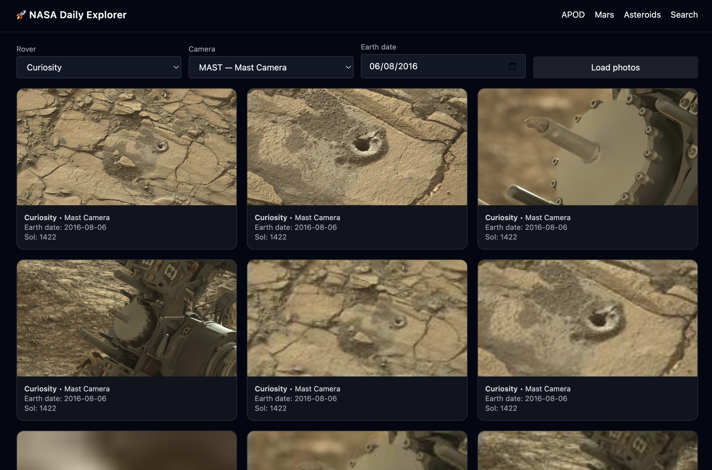
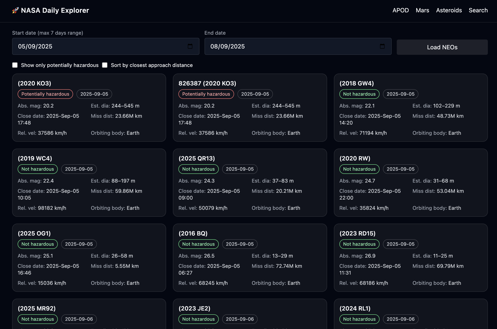
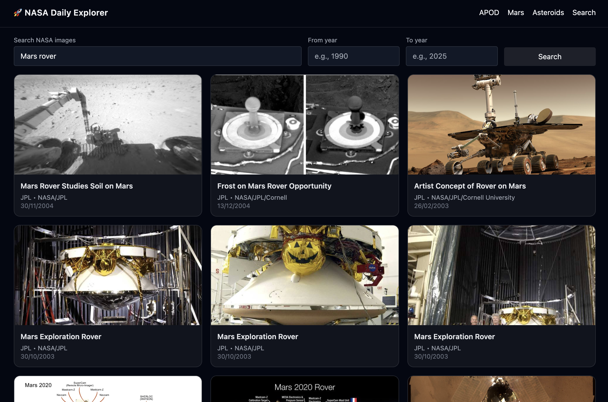

# NASA Daily Explorer

A minimalist, fast, dark-mode friendly space dashboard:
- **APOD** (Astronomy Picture of the Day)
- **Mars Rover Gallery** (filter by rover/camera/date)
- **Near-Earth Objects** (7-day NEO feed with hazard & distance)
- **NASA Image Search** (public images library)

## Tech
HTML5, Tailwind (CDN, `darkMode: 'class'`), Vanilla JS modules, NASA APIs.

## Live Demo

## Features
- Class-based **theme toggle** (persists via `localStorage`)
- Robust loading/error/empty states
- Accessible modals with keyboard/backdrop close
- Clean, scalable componentized JS (`src/ui.js`, page modules)

## Getting Started
Clone and open `index.html` locally (or via Live Server).
- Add your NASA key in `src/mars.js` / `src/asteroids.js` if needed.
- Search page uses the public Images API (no key).

## Screenshots

  
   
  
  

## License
MIT © Tanjya Akther
