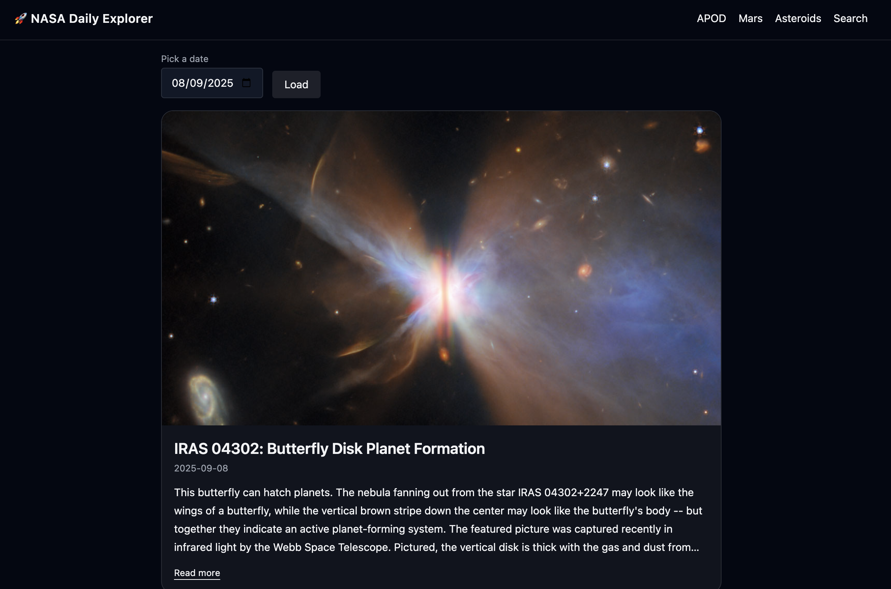
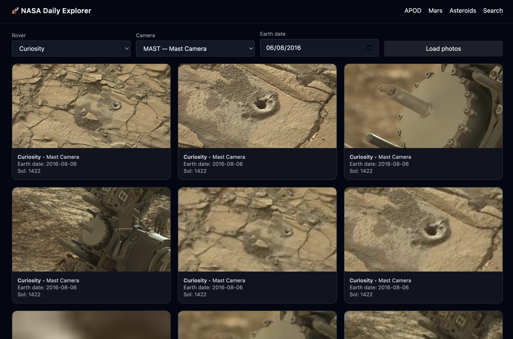
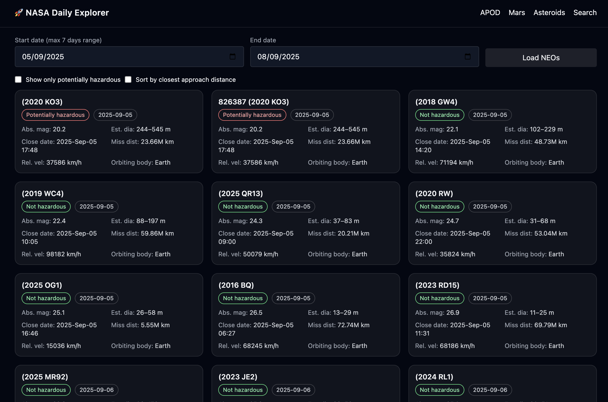
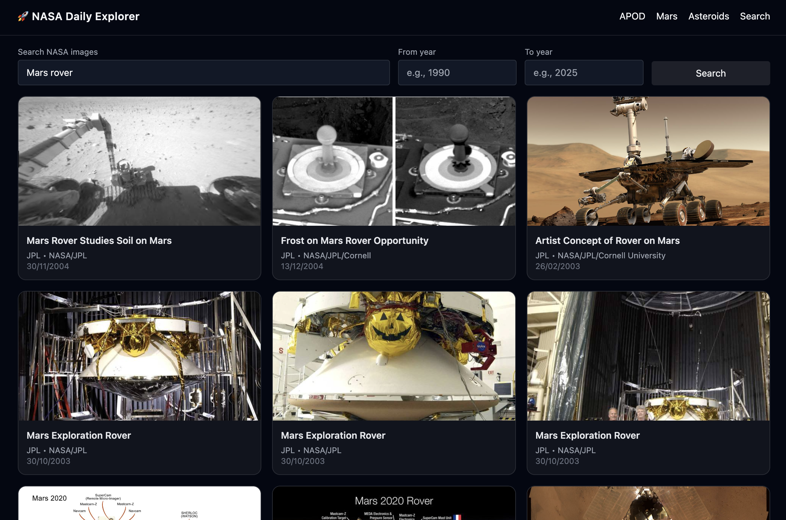

# NASA Daily Explorer 🚀

[](https://tanjya.github.io/nasa-portfolio)
[](https://github.com/Tanjya/nasa-portfolio)


Minimal, fast, dark-mode friendly dashboard for NASA data:
**APOD**, **Mars Rover Gallery**, **Near-Earth Objects**, and **NASA Image Search**.

---

## Features
- APOD with image/video handling (https enforced, thumbnails for videos)
- Mars photos by rover/camera/date with modal
- NEO 7-day feed with hazard & distance quick filters
- NASA Images search with paging, modal preview
- Class-based dark mode (persisted)

## Tech
- HTML5, Vanilla ES Modules (`/src/*`)
- Tailwind (CDN, `darkMode: 'class'`)
- NASA APIs (APOD, Mars, NEO, Images Library)

## Live
- **Demo:** [tanjya.github.io/nasa-portfolio](https://tanjya.github.io/nasa-portfolio/)
- **Repo:** [github.com/Tanjya/nasa-portfolio](https://github.com/Tanjya/nasa-portfolio)

## Screenshots
<div align="center">
  
  <br/>
  
  
</div>

## Quick start
```bash
# clone & open in a static server or just open index.html
git clone <REPO_URL>
cd nasa-portfolio
# if site is published from /docs, open docs/index.html

